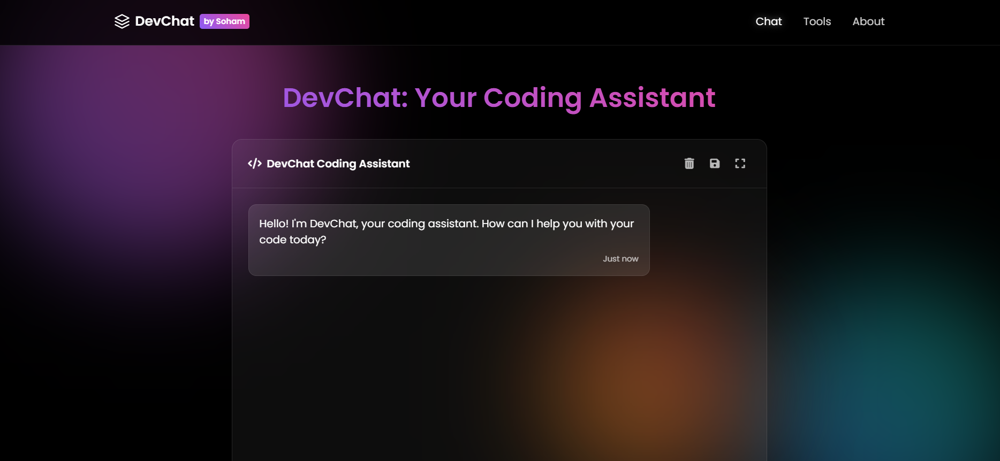

# DevChat by Soham

**DevChat** is a specialized coding assistant powered by Google's Gemini AI. Designed to help developers debug code, generate snippets, and explain programming concepts, DevChat provides an intuitive, chat-based interface that looks and feels like ChatGPT—with a focus on code.



## Features

- **Interactive Chat Interface**: Engage in natural language conversations to ask coding questions.
- **Smart Code Suggestions**: Receive intelligent code completions, debugging hints, and explanations.
- **Syntax-Highlighted Code Blocks**: Beautiful, ChatGPT-style code blocks with syntax highlighting using Highlight.js.
- **Copy Code Button**: Easily copy code snippets with a single click.
- **Fullscreen Mode**: Toggle the chat interface to full screen for an enhanced mobile experience.
- **Chat History & Export**: Save and retrieve your conversation history.

## Tech Stack

- **Backend**: Python, Flask, Google Generative AI (Gemini)
- **Frontend**: HTML, CSS, JavaScript, Highlight.js (Monokai Sublime theme), Font Awesome
- **Deployment**: Render.com

## Installation

Follow these steps to run DevChat locally:

1. **Clone the repository**:

   ```bash
   git clone https://github.com/<your-username>/<your-repo>.git
   cd <your-repo>
